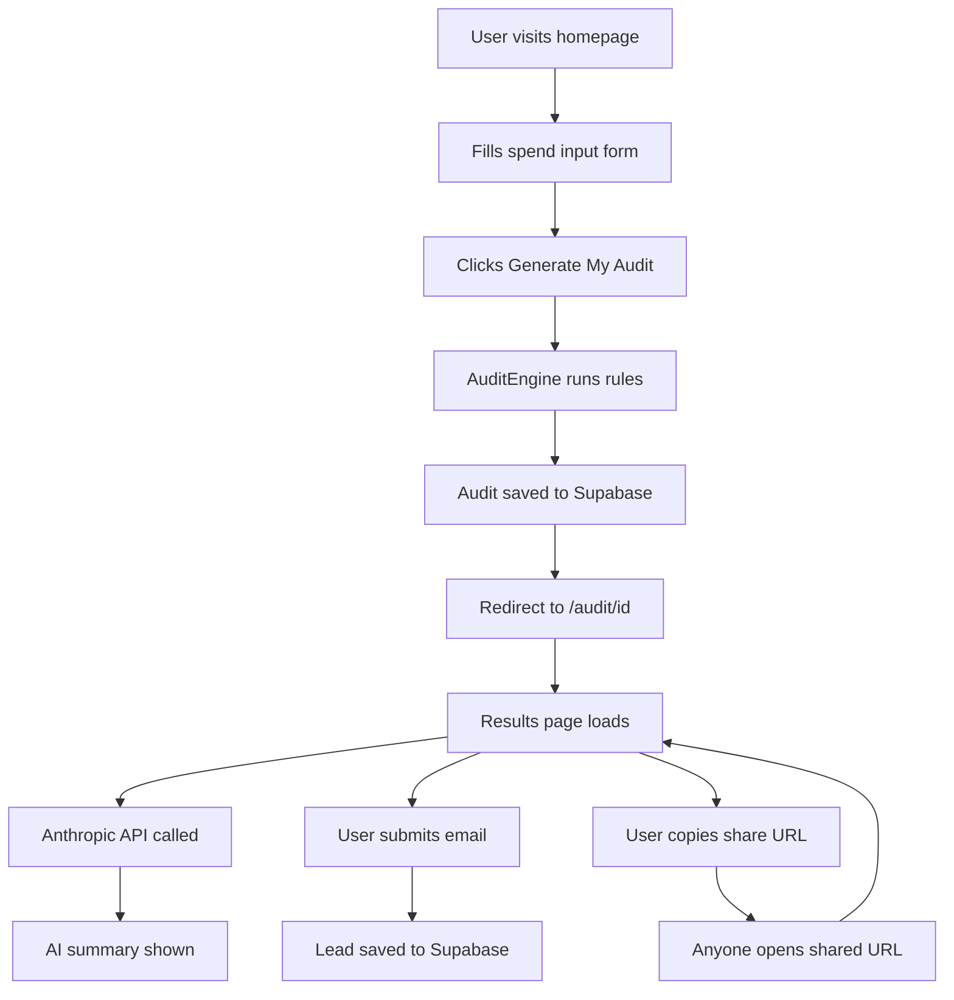

# Architecture

## System Diagram

## Data Flow

1. **User fills form** → React useState stores form data
2. **localStorage** → form data persists across page reloads
3. **Generate My Audit clicked** → runAudit() function called
4. **Audit engine** → loops through tools, applies 4 rules, calculates savings per tool and total
5. **Supabase insert** → audit saved with unique ID
6. **Redirect** → user sent to /audit/[id]
7. **Results page** → fetches audit from Supabase by ID
8. **Anthropic API** → called client-side with audit data, returns personalized summary (fallback if fails)
9. **Email capture** → POST to /api/leads, saved to Supabase
10. **Share URL** → public page strips email/company, shows only tools and savings

## Why I Chose This Stack

**Next.js** — chosen over plain React because it gives us server-side rendering for free, which is important for Open Graph meta tags to work correctly on social sharing. API routes are also built-in so no separate backend needed.

**Supabase** — chosen over Firebase because it's Postgres under the hood (SQL, familiar), has a generous free tier, and the JavaScript client is simple to use. For this scale, it's more than enough.

**Tailwind CSS** — chosen for speed of development. No context switching between CSS files and components. shadcn/ui gives pre-built accessible components on top.

**Vercel** — natural choice for Next.js. Auto-deploys on every push, free tier is sufficient, and environment variables are easy to manage.

**TypeScript** — chosen over JavaScript for type safety. The audit engine has complex data shapes (ToolEntry, AuditResult) that are much easier to work with when typed.

## What I'd Change for 10k Audits/Day

1. **Add a Redis cache** — audit results don't change, so cache them in Redis to avoid hitting Supabase on every shareable URL load

2. **Move Anthropic API call to server-side** — currently called from client, which exposes timing. Move to a server action for better performance.

3. **Add a job queue** — for email sending, use a queue (BullMQ or Inngest) instead of synchronous API calls

4. **Database indexes** — add indexes on audits.id and leads.audit_id for faster lookups at scale

5. **Rate limiting** — add proper rate limiting on /api/leads and /api/summary using Upstash Redis

6. **CDN for static assets** — already handled by Vercel, but would need custom CDN configuration at very high scale